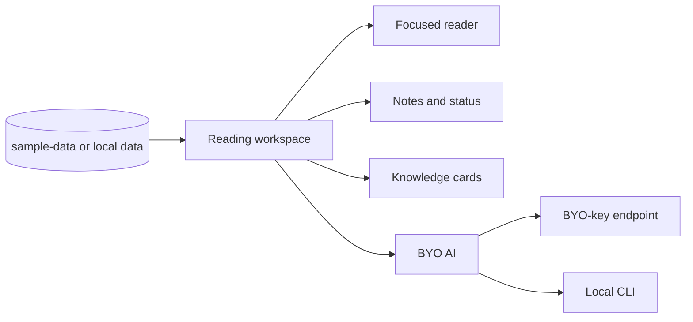

# reading-workbench

> A local-first reading workspace for collecting high-signal materials, reading them with context, and turning notes into reusable knowledge cards.

Reading Workbench is a small web app for people who read across many sources: essays, interviews, reports, papers, books, newsletters, podcasts, and short updates. It keeps the reading experience quiet and structured, while letting you bring your own AI model for lightweight help.

AI is an assistant here, not the reader. The app is designed to keep source notes, personal thoughts, and AI-generated text clearly separated.

---

## What It Does

- **Organizes a multi-source reading queue** by tracks such as Today, Deep Reads, Venture Radar, Browse, and All.
- **Opens items in a focused reading drawer** so you can stay in context instead of jumping between tabs.
- **Captures notes and reading status** while you read.
- **Creates knowledge cards** with three separate sections: source notes, your thoughts, and AI assistance.
- **Supports bring-your-own AI** through either an OpenAI-compatible endpoint or a local CLI such as Codex, Claude Code, or Ollama.
- **Runs locally first**: the static app works with sample data, and the optional local helper can write notes/cards/status to your own folder.

---

## Quick Start

```bash
git clone https://github.com/berayangsl/reading-workbench.git
cd reading-workbench
node serve.mjs
```

Open:

```text
http://localhost:8766
```

You can also serve it as a read-only static app:

```bash
python3 -m http.server 8765
```

Open:

```text
http://localhost:8765
```

The repository includes a small `sample-data/` set, so the app can be opened immediately after cloning.

---

## Bring Your Own AI

Open the **AI** panel in the app and choose one of two modes:

### BYO-key

Use any OpenAI-compatible endpoint, for example OpenAI, OpenRouter, or a local proxy.

Your key is stored only in your browser and requests go directly to the endpoint you configure.

### Local CLI

Run `node serve.mjs` and configure a local CLI in `vault.local.json`.

```bash
cp vault.local.example.json vault.local.json
```

Example presets in `vault.local.example.json` include Codex, Claude Code, and Ollama. The browser sends only the prompt to the local helper; the command itself is fixed in your local config.

---

## Local Notes

To save notes and knowledge cards as local files, configure:

```json
{
  "vaultCardsDir": "/absolute/path/to/your/notes/folder"
}
```

When the local helper is available, cards are written as Markdown files and reading state is stored locally. Without the helper, the app falls back to browser localStorage.

---

## How It Works



The app is intentionally simple:

1. Load reading items from JSON.
2. Browse by track, topic, status, type, or search.
3. Open an item in the reader drawer.
4. Capture notes, status, and cards.
5. Optionally ask your own model for summaries, questions, or card drafts.

---

## Project Structure

```text
reading-workbench/
├── index.html
├── styles.css
├── app.js
├── serve.mjs
├── sample-data/
├── vault.local.example.json
└── README.md
```

`serve.mjs` is both a static server and an optional local helper for file-based notes, cards, status, and local CLI calls.

---

## Known Limits

- This is a lightweight local app, not a hosted reading service.
- The included sample dataset is intentionally small.
- Browser-based BYO-key usage depends on the endpoint's CORS policy.
- The app does not include a content ingestion pipeline; bring or generate your own reading data.

---

## What This Is

A working prototype for a local-first AI-assisted reading workflow.

## What This Is Not

A content platform, a crawler, or a hosted SaaS product.
